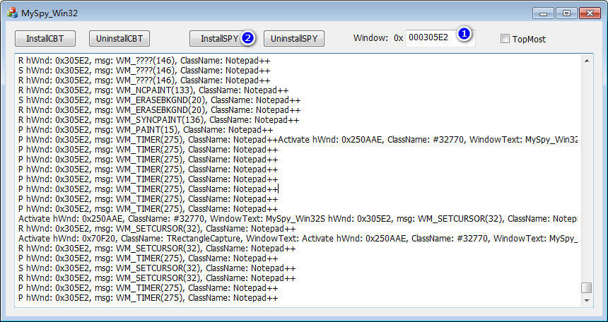

MyLiteSpy demonstrates how to hook WH_CBT, WH_CALLWNDPROC, WH_CALLWNDPROCRET and WH_GETMESSAGE.
By hooking WH_CALLWNDPROC, WH_CALLWNDPROCRET and WH_GETMESSAGE, we can capture other window's message like spy++.

32 bit MyLiteSpy can only capture 32 bit process's window.
64 bit MyLiteSpy can only capture 64 bit process's window.

First input a valid window handle and then click InstallSpy.
ScreenShot

Remarks(copy from https://msdn.microsoft.com/en-us/library/windows/desktop/ms644990(v=vs.85).aspx)

SetWindowsHookEx can be used to inject a DLL into another process. A 32-bit DLL cannot be injected into a 64-bit process, and a 64-bit DLL cannot be injected into a 32-bit process. If an application requires the use of hooks in other processes, it is required that a 32-bit application call SetWindowsHookEx to inject a 32-bit DLL into 32-bit processes, and a 64-bit application call SetWindowsHookEx to inject a 64-bit DLL into 64-bit processes. The 32-bit and 64-bit DLLs must have different names.
Because hooks run in the context of an application, they must match the "bitness" of the application. If a 32-bit application installs a global hook on 64-bit Windows, the 32-bit hook is injected into each 32-bit process (the usual security boundaries apply). In a 64-bit process, the threads are still marked as "hooked." However, because a 32-bit application must run the hook code, the system executes the hook in the hooking app's context; specifically, on the thread that called SetWindowsHookEx. This means that the hooking application must continue to pump messages or it might block the normal functioning of the 64-bit processes.
If a 64-bit application installs a global hook on 64-bit Windows, the 64-bit hook is injected into each 64-bit process, while all 32-bit processes use a callback to the hooking application.
To hook all applications on the desktop of a 64-bit Windows installation, install a 32-bit global hook and a 64-bit global hook, each from appropriate processes, and be sure to keep pumping messages in the hooking application to avoid blocking normal functioning. If you already have a 32-bit global hooking application and it doesn't need to run in each application's context, you may not need to create a 64-bit version.
An error may occur if the hMod parameter is NULL and the dwThreadId parameter is zero or specifies the identifier of a thread created by another process.
Calling the CallNextHookEx function to chain to the next hook procedure is optional, but it is highly recommended; otherwise, other applications that have installed hooks will not receive hook notifications and may behave incorrectly as a result. You should call CallNextHookEx unless you absolutely need to prevent the notification from being seen by other applications.
Before terminating, an application must call the UnhookWindowsHookEx function to free system resources associated with the hook.
The scope of a hook depends on the hook type. Some hooks can be set only with global scope; others can also be set for only a specific thread, as shown in the following table.
